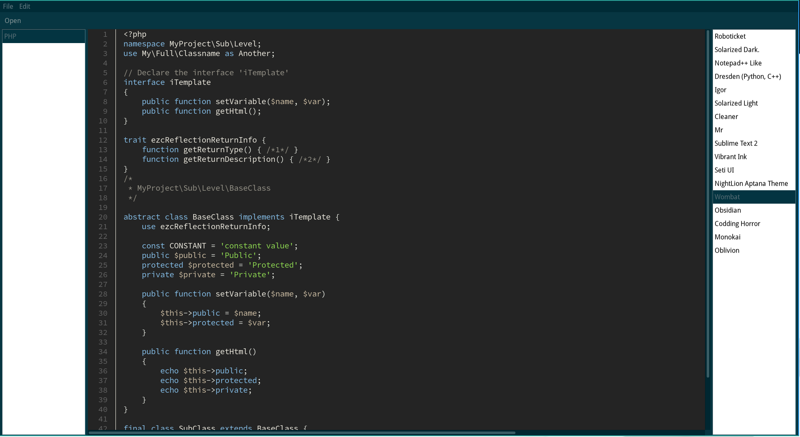

# xsintilla - Xojo Plugin

[](https://github.com/pattisahusiwa/xsintilla/blob/master/LICENSE)
[](https://github.com/pattisahusiwa/xsintilla/releases)


`xsintilla` is a text editor control based on [Scintilla](https://www.scintilla.org/) for [Xojo](https://xojo.com/) programming environment. It is developed using Xojo Plugins SDK v13 and Scintilla v3.7.6.


## Screenshot
Example of the `xsintilla` control in an application.



## How to build
### On Linux
To build the control, run the following command:
```bash
make
```

### On Windows and Mac OS
Please create a build script for your operating system based on `makefile` in this repository. PRs are welcome.

## License
Released under [Apache-2.0 License](https://opensource.org/licenses/Apache-2.0). See [LICENSE](./LICENSE) file for more details.

````
   Copyright 2016 Asis Pattisahusiwa

   Licensed under the Apache License, Version 2.0 (the "License");
   you may not use this file except in compliance with the License.
   You may obtain a copy of the License at

       http://www.apache.org/licenses/LICENSE-2.0

   Unless required by applicable law or agreed to in writing, software
   distributed under the License is distributed on an "AS IS" BASIS,
   WITHOUT WARRANTIES OR CONDITIONS OF ANY KIND, either express or implied.
   See the License for the specific language governing permissions and
   limitations under the License.
````
